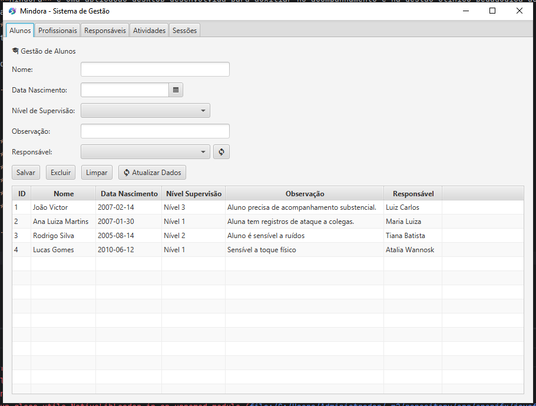
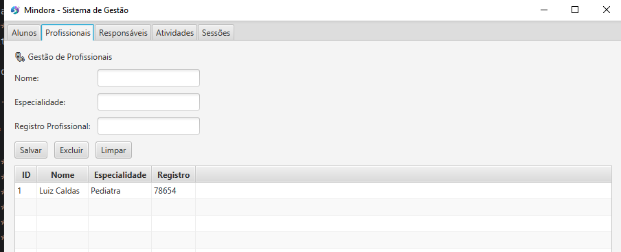
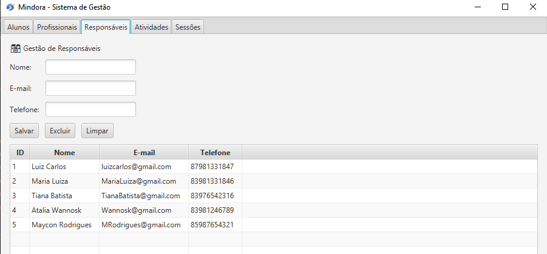
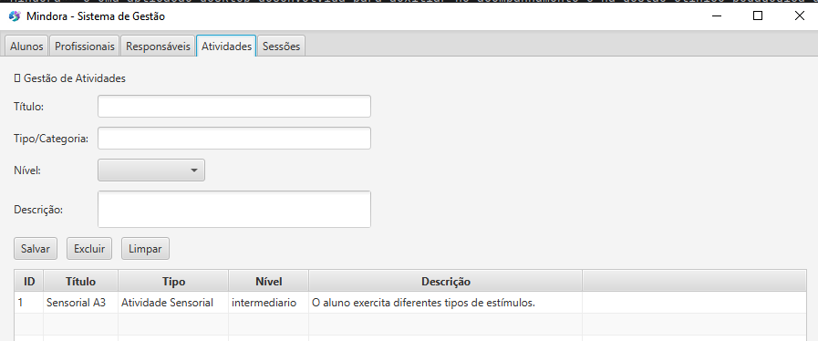
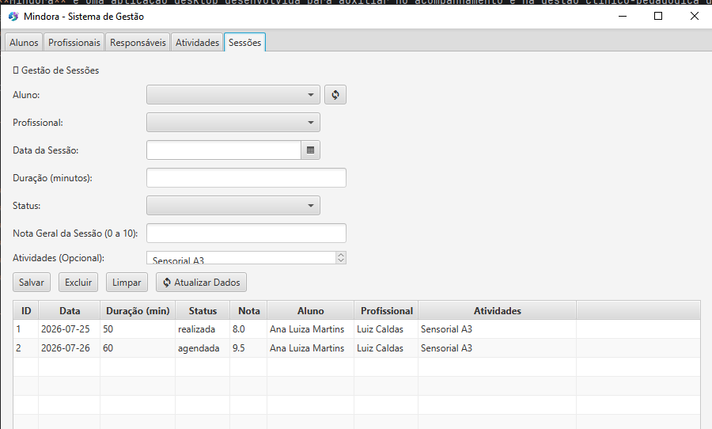

# Mindora - Sistema de Gestão e Acompanhamento de Alunos com TEA

O **Mindora** é uma aplicação desktop desenvolvida para auxiliar no acompanhamento e na gestão clínico-pedagógica de alunos com **TEA (Transtorno do Espectro Autista)**. O sistema permite o cadastro centralizado de **Alunos**, **Responsáveis**, **Profissionais Multidisciplinares**, **Atividades** e o agendamento/registro de **Sessões de Atendimento**.

Projeto desenvolvido como requisito de avaliação da disciplina de **Programação Orientada a Objetos (POO)**.

---

## 🛠️ Tecnologias Utilizadas

- **Linguagem:** Java 21
- **Interface Gráfica:** JavaFX 21
- **Gerenciador de Dependências:** Apache Maven
- **Banco de Dados:** PostgreSQL
- **Persistência de Dados:** Java Database Connectivity (JDBC)
- **Arquitetura:** Model-View-Controller (MVC) + Data Access Object (DAO)

---

<details>
  <summary><b>📸 Clique aqui para ver a interface do sistema</b></summary>
  <br>
  <p align="center">
    
    
  </p>
  <p align="center">
    
    
  </p>
  <p align="center">
    
  </p>
</details>

---

## 📂 Estrutura do Projeto

```text
mindora/
├── sql/
│   ├── 01_create_database.sql
│   └── 02_create_tables.sql
├── src/
│   └── main/
│       ├── java/
│       │   └── mindora/
│       │       ├── config/
│       │       │   └── ConnectionFactory.java
│       │       ├── dao/
│       │       │   ├── AlunoDAO.java
│       │       │   ├── AtividadeDAO.java
│       │       │   ├── ProfissionalDAO.java
│       │       │   ├── ResponsavelDAO.java
│       │       │   └── SessaoDAO.java
│       │       ├── model/
│       │       │   ├── Aluno.java
│       │       │   ├── Atividade.java
│       │       │   ├── Profissional.java
│       │       │   ├── Responsavel.java
│       │       │   └── Sessao.java
│       │       ├── view/
│       │       │   ├── AlunoView.java
│       │       │   ├── AtividadeView.java
│       │       │   ├── ProfissionalView.java
│       │       │   ├── ResponsavelView.java
│       │       │   └── SessaoView.java
│       │       ├── Applauncher.java
│       │       └── Main.java
│       └── resources/
│           ├── images/
│           │   └── LogoMindora64px.jpg
│           ├── db.properties
│           └── db.properties.example
├── .gitignore
├── pom.xml
└── README.md
```

---

## 📝 Licença e Autoria

Este projeto foi idealizado e desenvolvido por **João Victor Batista de Araújo Abrantes** como requisito de avaliação da disciplina de **Programação Orientada a Objetos (POO)**.

Copyright © 2026 **[JotaveHub]**. Todos os direitos reservados.
